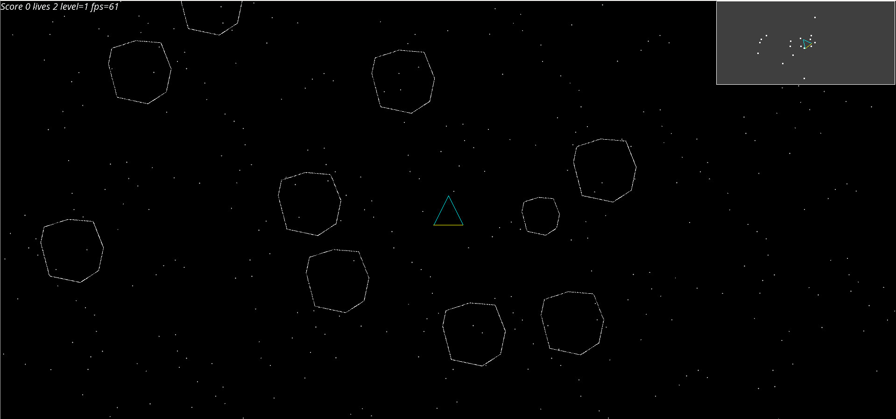

# ScalaBattle



a libgdx game, like a big asteroids. Did something similar in python and tk

to build

```
./gradlew desktop:run
```

to make a distribution
```
./gradlew desktop:dist
```

to run the release just download then do
```
java -jar desktop-1.0.jar
```
